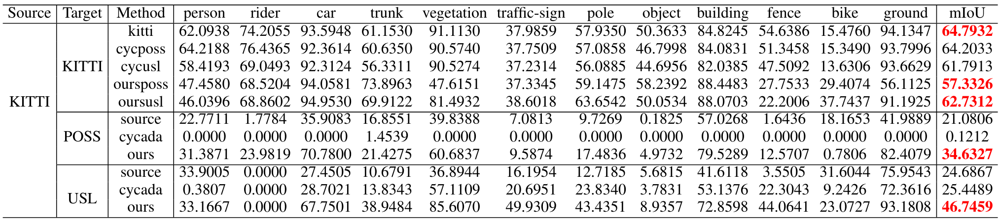
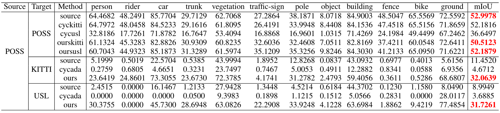
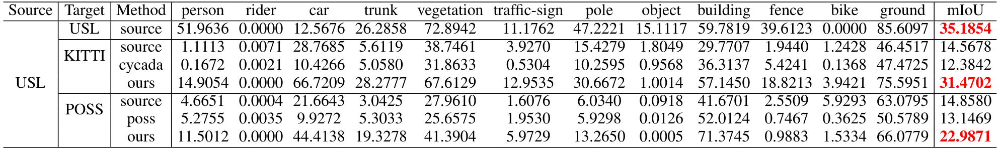

# LiDARNet: A Boundary-Aware Domain Adaptation Model for Point Cloud Semantic Segmentation

We present a boundary-aware domain adaptation model for LiDAR scan full-scene semantic segmentation (LiDARNet). Our model can extract both the domain private features and the domain shared features with a two branch structure.  We embedded Gated-SCNN into the segmentor component of LiDARNet to learn boundary information while learning to predict full-scene semantic segmentation labels. Moreover, we further reduce the domain gap by inducing the model to learn a mapping between two domains using the domain shared and private features. Besides, we introduce a new dataset ([SemanticUSL](https://unmannedlab.github.io/research/SemanticUSL)). The dataset has the same data format and ontology as SemanticKITTI. We conducted experiments on real-world datasets [SemanticKITTI](http://semantic-kitti.org/), [SemanticPOSS](poss.pku.edu.cn/semanticposs.html), and SemanticUSL, which have differences in channel distributions, reflectivity distributions, diversity of scenes, and sensors setup. Using our approach, we can get a single projection-based LiDAR full-scene semantic segmentation model working on both domains. Our model can keep almost the same performance on the source domain after adaptation and get an 8%-22% mIoU performance increase in the target domain.

**Updates:**

**The paper is released on [arXiv](https://arxiv.org/abs/2003.01174)**

**The Code will come soon**

## Results

**Experiment I: From SemanticKITTI to SemanticPOSS and SemanticUSL** 

[](https://www.youtube.com/embed/62C9cKzw3eY)




<br/><br/>

**Experiment II: From SemanticPOSS to SemanticKITTI and SemanticUSL**

[](https://www.youtube.com/embed/jd-OaQ3jD5k)




<br/><br/>
**Experiment III: From SemanticUSL to SemanticPOSS and SemanticKTTI**

[](https://www.youtube.com/embed/eRk7VJbQsRM)



## Citation
```
@misc{jiang2021lidarnet,
      title={LiDARNet: A Boundary-Aware Domain Adaptation Model for Point Cloud Semantic Segmentation}, 
      author={Peng Jiang and Srikanth Saripalli},
      year={2021},
      eprint={2003.01174},
      archivePrefix={arXiv},
      primaryClass={cs.CV}
}
```
## Related Work

[SemanticUSL: A Dataset for Semantic Segmentation Domain Adatpation](https://unmannedlab.github.io/research/SemanticUSL)

[RELLIS-3D: A Multi-modal Dataset for Off-Road Robotics](https://unmannedlab.github.io/research/RELLS-3D)


